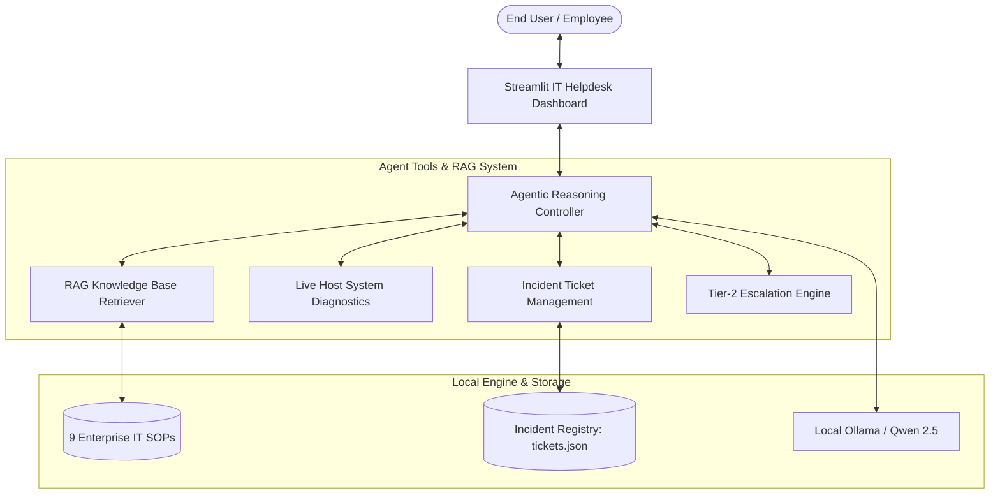

# AI IT Helpdesk Agent (Agent + RAG + Tools)

An autonomous, private, enterprise-grade AI IT Helpdesk Support Agent built using **Python**, **Streamlit**, **Ollama**, and **Qwen 2.5**. Developed specifically for **Use Case #4: AI IT Helpdesk Agent** (IBM Agentic AI Project).

---

## 🎯 Use Case Alignment (#4: AI IT Helpdesk Agent)

| Category | Implementation |
| :--- | :--- |
| **Objective** | Diagnoses common enterprise technical issues and recommends troubleshooting steps using a knowledge base. |
| **Key Agent Capabilities** | **Agent + RAG + Tools** (Autonomous reasoning, SOP retrieval, live system diagnostics, and incident ticket lifecycle). |
| **Data Privacy** | **100% Local & On-Device** inference via Ollama (`qwen2.5`). No telemetry, external APIs, or cloud dependencies. |

---

## 🌟 Key Architecture & Capabilities



### 1. 📚 Local RAG Knowledge Base (9 Enterprise SOPs)
- **Network & VPN:** Error 800/806 resolution, DNS cache flushing, Wi-Fi DHCP conflicts.
- **Account & Security:** Active Directory lockout policies, Self-Service Password Reset (SSPR), MFA sync.
- **Hardware & Peripherals:** Offline network printers & print spooler reset, multi-monitor docking station detection.
- **Software & System:** High CPU/RAM memory leaks, Windows BSOD triage, Outlook OST mailbox sync repair.

### 2. ⚙️ Agent Tools (Function Execution)
- **`search_knowledge_base(query)`**: Semantic search across IT troubleshooting procedures with citation of KB IDs.
- **`run_system_diagnostics()`**: Live non-destructive host scanner checking RAM, Disk free space, Network ping reachability, and OS health.
- **`create_ticket(title, description, category, priority)`**: Automated creation of structured tickets (e.g. `INC-2026-4819`) with priority levels (*Critical, High, Medium, Low*).
- **`escalate_ticket(ticket_id, reason)`**: Reassigns ticket to Tier-2 Senior Engineers.

### 3. 🖥️ Interactive Helpdesk UI
- **Quick Issue Chips:** 1-click triage buttons for Account Lockouts, VPN Errors, System Diagnostics, and Offline Printers.
- **Live Ticket Tracker Drawer:** Real-time sidebar view of all logged tickets with priority status badges.
- **Visual Tool Invocation Badges:** Clear visibility into which tools the agent executed before generating the response.
- **Chat Transcript Export:** Download conversations as Markdown documents.

---

## 🚀 Quick Start Guide

### Step 1: Install Dependencies
```bash
pip install -r requirements.txt
```

### Step 2: Ensure Ollama is Running with Qwen
```bash
ollama pull qwen2.5
```

### Step 3: Launch the IT Helpdesk Agent
```bash
streamlit run app.py
```
Or double-click **`run.bat`** on Windows!

Open your browser at **`http://localhost:8501`**.

---

## 📁 Project Structure

```text
IBM-AGENTICAI/
│
├── app.py              # Streamlit IT Helpdesk Dashboard & Agent Loop
├── knowledge_base.py   # IT Knowledge Base SOPs & RAG Retriever
├── tools.py            # Diagnostic scanner, Ticket system, Escalations
├── tickets.json        # Persistent incident ticket database
├── requirements.txt    # Dependencies (streamlit, ollama, requests)
├── run.bat             # One-click Windows launcher
└── README.md           # Documentation
```
